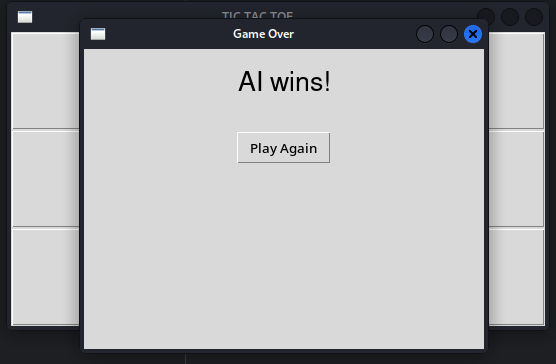

# Tic Tac Toe with AI

Tic Tac Toe is a classic two-player game, and in this project, I've created a single-player version where you can play against a simple AI. The game features a graphical user interface built using Python's Tkinter library.

## Features

- **Single-player mode**: Play against a random-move AI.
- **Graphical User Interface**: A simple and user-friendly interface.
- **Win and Tie Detection**: The game checks for wins and ties.
- **Restart Option**: After a game ends, you can easily restart.

## Screenshots

Here are some screenshots of the game:





## Getting Started

To run this project, you need to have Python installed on your computer. 

### Prerequisites

- Python 3.x
- Tkinter (usually included with Python installations)

### Installation

1. Clone the repository:
   ```bash
   git clone https://github.com/szymon-tulodziecki/tic_tac_toe.git
